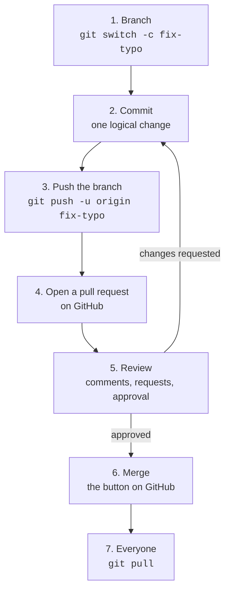

# Session 1½ — Git as a collaboration tool

**Reading, at home, between Sessions 1 and 2. About 40 minutes. Nothing to install, nothing to hand in.**

Session 1 taught you Git as a *personal* tool: snapshots, branches, merges, one repository on your laptop and a copy on GitHub. But Git was written so that thousands of people could work on the same code without stepping on each other, and every software team, every open-source project and — increasingly — every research group with a replication package runs on the workflow described here. There is no time to practise it in class. You do need the vocabulary and the gist: in Session 4 an agent will work on a branch of your repository and you will *review* what it did, exactly the way a colleague's contribution is reviewed. And in your first job, "open a PR" will be said to you in week one.

Read it once now. Come back to it when a word on GitHub makes no sense.

## 1. Remotes: `origin` is just a name

When you ran `git clone` in the exercises, Git did three things: copied the whole history, checked out the default branch (`main`), and recorded where the copy came from under the name **`origin`**. A *remote* is nothing more than a named URL that Git knows how to push to and pull from.

```bash title="Any terminal, inside a cloned repository"
git remote -v
```

```text
origin  https://github.com/KnuxV/scrabble-counter.git (fetch)
origin  https://github.com/KnuxV/scrabble-counter.git (push)
```

Three consequences you saw in the exercises:

- **Reading is not writing.** A public repository can be cloned by anyone; pushing needs write permission on *that* repository. Your clone of the course exercise points at the instructor's repository, so `git push` is refused. Your commits are safe on your machine; they simply have nowhere to go yet.
- **You can have several remotes.** `origin` is a convention, not a rule. Add your own empty repository as a second remote and push there — on GitHub, on GitLab, on the university's forge, anywhere:

    ```bash title="Any terminal, inside the repository"
    git remote add mine https://github.com/YOUR-USERNAME/scrabble-counter.git
    git push -u mine main
    git remote -v          # two remotes now
    ```

    People routinely push the same repository to GitHub *and* GitLab, or to a mirror at their institution.

- **Branches have a remote side.** `git branch -a` lists your local branches and the *remote-tracking* ones, named `origin/german`, `origin/main`… Those are Git's memory of what the remote looked like the last time you talked to it (`git fetch` refreshes that memory without touching your files; `git pull` = fetch + merge into your current branch).

Reference: [Pro Git — Working with Remotes](https://git-scm.com/book/en/v2/Git-Basics-Working-with-Remotes) · [GitHub — About remote repositories](https://docs.github.com/en/get-started/git-basics/about-remote-repositories).

## 2. Clone vs fork

Both give you a copy of someone else's repository. The difference is *where* the copy lives.

| | `git clone` | Fork |
|---|---|---|
| What it is | A copy **on your machine** | A copy **on GitHub, under your account**, which you then clone |
| Done with | A command in the terminal | The **Fork** button on the repository page |
| Can you push? | Only if the owner gave you write access | Yes, always — it is your repository |
| Is your work visible online? | No | Yes, on your fork |
| Can you send changes back to the original? | Only if you have write access | Yes, through a pull request (next section) |
| Typical use | Your own repos; a colleague's repo you are a collaborator on; grabbing a project to *use* it | Contributing to a project you do not own; keeping a public trace of an exercise |

A fork remembers where it came from: GitHub shows "forked from KnuxV/…" under the name. By convention, when you clone your fork, you add the original as a second remote called **`upstream`**, so you can pull the original's new commits into your fork later:

```bash title="Any terminal, inside your clone of the fork"
git remote add upstream https://github.com/KnuxV/scrabble-counter.git
git fetch upstream
git merge upstream/main        # bring the original's new commits into your main
```

For the course exercises: **clone** if you just want to do the work; **fork** if you want the result on your GitHub profile. Either is fine.

Reference: [GitHub — About forks](https://docs.github.com/en/pull-requests/collaborating-with-pull-requests/working-with-forks/about-forks) · [Fork a repository](https://docs.github.com/en/pull-requests/collaborating-with-pull-requests/working-with-forks/fork-a-repo) · [Syncing a fork](https://docs.github.com/en/pull-requests/collaborating-with-pull-requests/working-with-forks/syncing-a-fork).

## 3. The pull request: how changes get reviewed

Here is the loop that a team of two or two thousand uses. GitHub calls it the [GitHub flow](https://docs.github.com/en/get-started/using-github/github-flow); GitLab calls a pull request a *merge request*; the idea is identical everywhere.



1. **Nobody commits to `main` directly.** Work happens on a branch with a descriptive name. On serious projects `main` is *protected*: GitHub refuses pushes to it that did not come through a pull request.
2. Commits on the branch, as in Session 1: one logical change each, imperative messages.
3. `git push -u origin <branch>` publishes *the branch* — `main` on the remote is untouched.
4. A **pull request** (PR) is a page on GitHub that says: "please merge branch X into `main`". It shows the diff (*Files changed* tab), the commits, and a conversation. It is *not* a Git object — it lives on GitHub, not in `.git` — which is why the same thing has a different name on GitLab.
5. **Review.** Colleagues read the diff, leave comments on specific lines, and end with *Approve* or *Request changes*. You push more commits to the same branch; the PR updates itself. This is where quality is enforced, and it is the human skill Session 4 automates: reading a diff and deciding whether it does what was asked.
6. **Merge.** One button. GitHub offers three flavours — *merge commit* (what `git merge` does; keeps the branch shape), *squash* (all the branch's commits collapsed into one), *rebase* (commits replayed on top of `main`, straight line). Default to the first until you have an opinion. Then delete the branch; its commits are in `main` now.
7. Everyone else runs `git pull` and has the change.

A PR is also the unit of *conversation* about code: the description says what and why, the review says whether, the merge says when. Six months later, `git log` plus the PR page is how a team reconstructs a decision. Reference: [About pull requests](https://docs.github.com/en/pull-requests/collaborating-with-pull-requests/proposing-changes-to-your-work-with-pull-requests/about-pull-requests) · [About pull request reviews](https://docs.github.com/en/pull-requests/collaborating-with-pull-requests/reviewing-changes-in-pull-requests/about-pull-request-reviews).

!!! note "Contributing to a project you do not own"
    Same loop, with a fork in front: fork → clone your fork → branch → push to *your fork* → open the PR *from your fork's branch to the original's `main`*. GitHub's [Contributing to a project](https://docs.github.com/en/get-started/exploring-projects-on-github/contributing-to-a-project) walks through it. This is how you fix a typo in the documentation of a package you use — a real and welcome first contribution.

### When the PR cannot be merged

If `main` moved since you branched and touched the same lines, GitHub shows *This branch has conflicts that must be resolved*. Nothing new: it is the conflict of [Session 1 §5.5](s1.md#55-case-3-both-sides-changed-the-same-line-conflict). Resolve it locally — `git pull origin main` into your branch, edit the markers, commit, push — or in GitHub's web editor for small ones. Reference: [About merge conflicts](https://docs.github.com/en/pull-requests/collaborating-with-pull-requests/addressing-merge-conflicts/about-merge-conflicts).

## 4. Issues: the to-do list next to the code

An **issue** is a numbered ticket on the repository: a bug report, a feature request, a question, a task. It has a title, a description, labels (`bug`, `documentation`, `good first issue`), an assignee, and a conversation. Issues and pull requests are linked: a PR whose description says `Fixes #12` closes issue 12 when it is merged, and the issue page shows which commit did it.

Why it matters to you, specifically:

- It is the **audit trail**. "Table 3 does not reproduce with the published code" is an issue; the PR that fixes it is the fix; the link between them is the paper trail a data editor asks for. The optional [replication track](../replication.md) expects exactly this discipline.
- It is how you **ask a project for help** without emailing a stranger: search the issues first (your problem is usually there), then open one with a minimal reproducible example.
- In Session 4, a spec file plays the role of an issue for an agent: a precise statement of what is wanted, written *before* the code.

Reference: [About issues](https://docs.github.com/en/issues/tracking-your-work-with-issues/about-issues).

## 5. CI/CD: robots that run on every push

**Continuous integration** means: every time a commit is pushed or a PR is opened, a machine somewhere checks out the code and runs the tests, automatically, and reports a green check or a red cross on the PR. **Continuous deployment** goes one step further: if the checks pass on `main`, the result is published — a website, a package, a container.

On GitHub this is **GitHub Actions**: a *workflow* is a YAML file in `.github/workflows/`, triggered by events (`push`, `pull_request`, a schedule), running *jobs* made of *steps* on a fresh virtual machine. You have already used one without knowing: this website is built and published by [`.github/workflows/site.yml`](https://github.com/KnuxV/cours-agents/blob/main/.github/workflows/site.yml) in the course repository — every push to `main` that touches `site/` runs `mkdocs build --strict`, and if that passes, deploys the result. If it fails, the push shows a red cross and the old site stays up.

A minimal test workflow for a Python project, for recognition rather than for typing:

```yaml title=".github/workflows/tests.yml"
name: tests
on: [push, pull_request]
jobs:
  test:
    runs-on: ubuntu-latest
    steps:
      - uses: actions/checkout@v4
      - uses: astral-sh/setup-uv@v6
      - run: uv sync
      - run: uv run pytest
```

Why this is the most important section of the page for this course: Session 4 will argue that **the most reliable component of an agent system is not a model, it is the test suite**. CI is what gives the test suite teeth. A PR — written by a colleague or by an agent — with a red cross does not get merged; nobody has to remember to run the tests, and nobody can skip them. Reference: [Understanding GitHub Actions](https://docs.github.com/en/actions/get-started/understand-github-actions).

## 6. What this means for working with agents

Put the pieces together and you have the working arrangement of Session 4:

1. You write down what you want (a spec — the issue).
2. The agent works **on a branch** of a repository whose `main` is clean (Session 1's first rule).
3. You review **the diff**, not the agent's summary (Session 1's second rule) — that is the PR review.
4. **Tests run automatically**; a red cross is a rejection, whatever the agent says.
5. Only then merge.

Everything an agent does becomes a commit on a branch: reviewable, revertible, attributable. That is why this course insisted on Git before touching an API.

## 7. Vocabulary

| Word | Meaning |
|---|---|
| **remote** | A named URL of another copy of the repository (`origin`, `upstream`, `mine`…) |
| **origin** | The conventional name of the remote you cloned from |
| **upstream** | The conventional name of the *original* repository, when `origin` is your fork |
| **clone** | A full local copy of a repository, with its history |
| **fork** | A copy of a repository under your own GitHub account |
| **pull request (PR)** / **merge request (MR)** | A request, on GitHub/GitLab, to merge one branch into another, with a diff and a review conversation |
| **review** | Reading a PR's diff and approving it or requesting changes |
| **protected branch** | A branch (usually `main`) that only accepts changes through PRs |
| **issue** | A numbered ticket: bug, task, question |
| **CI / CD** | Automatic checks on every push / automatic publication when they pass |
| **workflow**, **Actions** | GitHub's CI system and its YAML files in `.github/workflows/` |
| **fetch** / **pull** | Download the remote's new commits / download and merge them |

## Optional, hands-on (about one hour)

[GitHub Skills — Introduction to GitHub](https://github.com/skills/introduction-to-github) is a repository you copy into your account; a bot then guides you through branch → commit → pull request → merge on GitHub itself, with automatic feedback at each step. It is the best available practice of sections 3 and 5, and it is free. If you do one optional thing before Session 4, do this.

## Going further

1. [Pro Git — Distributed Workflows](https://git-scm.com/book/en/v2/Distributed-Git-Distributed-Workflows) — the three team shapes (centralised, integration-manager, dictator-and-lieutenants) and why GitHub's fork-and-PR is the second.
2. [GitHub flow](https://docs.github.com/en/get-started/using-github/github-flow) — the official one-page description of section 3.
3. [GitLab — Merge requests](https://docs.gitlab.com/user/project/merge_requests/) — the same thing under its other name; you will meet GitLab at most French institutions.
4. [Understanding GitHub Actions](https://docs.github.com/en/actions/get-started/understand-github-actions) — workflows, jobs, steps, runners, in one page.
5. [How to Write a Git Commit Message](https://cbea.ms/git-commit/) — read again now that you know who reads them: the reviewer.
