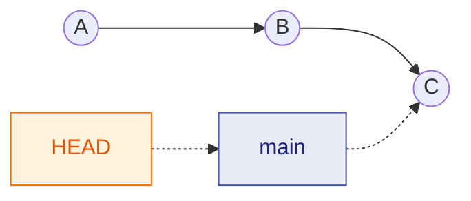
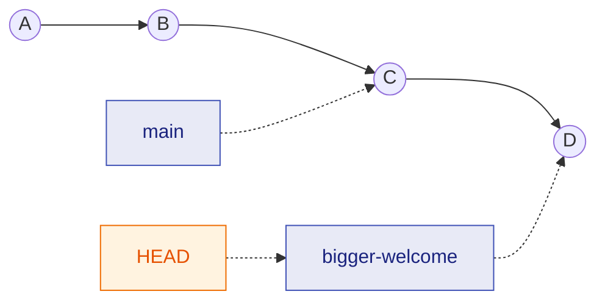
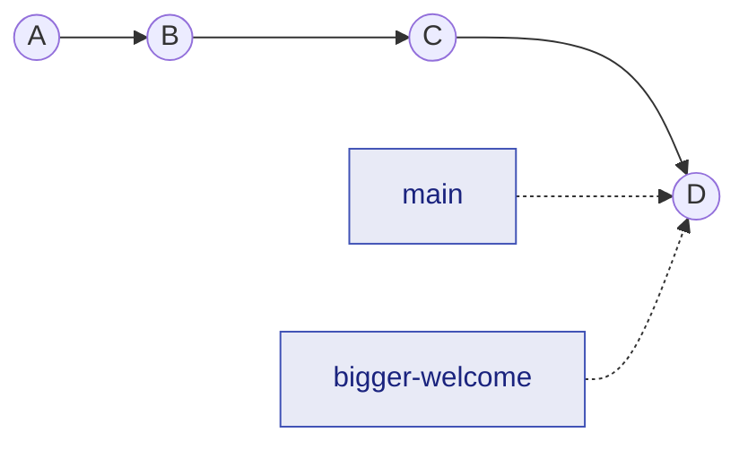
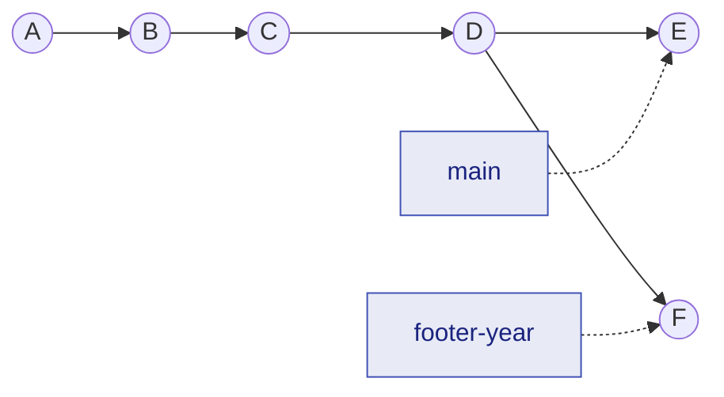
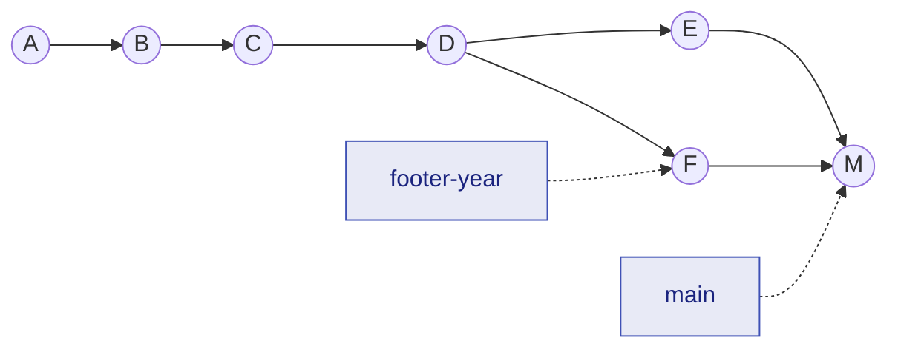
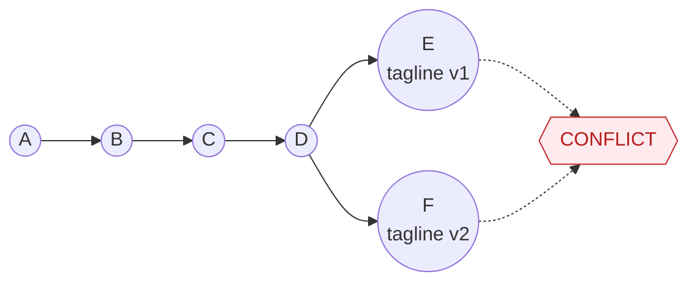

# Session 1 — Git

**Monday 14 September 2026, 14:00–16:00, room A330 (Idem-Lab).**

Slides: *to be published* (`slides/s1-git.md`). This page is the complete version: everything said in class is written here, so you can redo the session alone.

## Goals

By the end of the two hours you can, without looking anything up:

1. explain what a commit is (a snapshot of a folder, not a diff, not a save button);
2. run the basic cycle — `git status`, `git add`, `git commit`, `git log`, `git diff` — and read what each one prints;
3. get a file back after breaking or deleting it;
4. create a branch, commit on it, merge it back — and explain the difference between a fast-forward, a merge commit and a conflict;
5. clone a repository from GitHub and publish one of your own;
6. say why version control matters *more* now that agents write code.

**Deliverable:** your personal course repository `agent-lab`, on GitHub, with at least one commit. Sessions 2, 3 and 4 all happen inside it.

Collaboration — forks, pull requests, issues, CI — is **not** covered in class: it is the [Session 1½ reading](s1-collab.md), to do at home before Session 2.

## Before class (10 minutes at home)

- [Session 0](../setup.md) is done: you have a terminal whose prompt ends in `$` (or `%` on a Mac).
- You have a [GitHub account](https://github.com/signup). Creating one takes five minutes at home and ten in a room of thirty people — do it at home. Use your real name or a handle you are fine putting on a CV; you will keep this account.
- `git` is installed. Check:

=== "WSL (Ubuntu)"

    ```bash title="Ubuntu window (WSL)"
    git --version
    ```

    If it prints `git version 2.x`, you are fine. If it says `command not found`:

    ```bash title="Ubuntu window (WSL)"
    sudo apt update && sudo apt install -y git
    ```

=== "Mac"

    ```bash title="Terminal (Mac)"
    git --version
    ```

    If a window offers to install the *Command Line Developer Tools*, accept — this is step B2 of the [setup page](../setup.md#path-b-mac). It takes several minutes; do it at home.

=== "Git Bash"

    Git Bash *is* git. Nothing to do:

    ```bash title="Git Bash"
    git --version
    ```

=== "Codespaces"

    Nothing to do — git and the GitHub CLI are preinstalled and already logged in to your account.

    ```bash title="Codespace terminal (browser)"
    git --version
    ```

## 1. Why version control, and why doubly now

You have already invented version control, badly: `memoire_v2.docx`, `memoire_v2_final.docx`, `memoire_v2_final_REAL.docx`. Git is the same idea done properly. You keep working on the same files; Git keeps every snapshot you ask it to keep, with a date, an author, and a message, and can show you the difference between any two of them or bring any of them back.

For *your own* work, that gives you:

- an **undo button** that reaches back weeks, not seconds;
- the freedom to try something risky, because the working version is one command away;
- a history that explains *why* the code looks the way it does.

For work done by an **AI coding agent** — Sessions 3 and 4 — this stops being comfort and becomes safety. An agent edits ten files in thirty seconds. Without git you cannot see what it touched, you cannot tell its good edits from its bad ones, and you cannot go back. With git, every one of those edits is a diff you can read and a commit you can revert. Two rules you will apply from Session 4 on:

!!! quote "Rules of the agent era"
    1. **Commit before you let an agent touch the repository.** A clean working tree is the state you can always return to.
    2. **`git diff` is how you review what it did.** Not the agent's summary of what it did — the diff.

An agent without git is a liability. That is the whole reason this session comes first.

## 2. The mental model: three places, one history

Git does not track a file. It tracks a **folder** (a *repository*, or *repo*), as a series of **snapshots** you choose to take. Each snapshot is a **commit**. Think of three places your work can be:

```text
 your files on disk        the staging area          the history (.git)
 ("working tree")          ("index", a loading dock)  (commits, permanent)

   edit files  ───git add───▶  chosen changes  ───git commit───▶  snapshot #7
                                                                  snapshot #6
       ◀───────────────────── git restore ────────────────────    snapshot #5
                                                                      ...
```

- **Working tree** — the normal files you edit with any editor.
- **Staging area** — where you put the changes you want in the *next* commit. This extra step is deliberate: you often have three unrelated edits in a folder and want to commit only the finished one.
- **History** — the commits, stored in a hidden folder called `.git` at the root of the repo. Delete `.git` and the history is gone; the folder goes back to being plain files.

A commit records the **whole folder as it was** at that moment, not "what changed". (Git is clever about storage, but the model you should carry is *snapshot*, not *diff*.) Each commit has a permanent identifier, its **hash** — a 40-character hexadecimal string, of which you will only ever type the first seven.

Reference for the curious: [Pro Git §1.3, "What is Git?"](https://git-scm.com/book/en/v2/Getting-Started-What-is-Git%3F).

## 3. One-time configuration

Git stamps your name and email on every commit. Set them once; this is global to your machine. The last two lines avoid two classic traps: new repositories are still created with a branch called `master` unless told otherwise (GitHub and this course use `main`), and `git commit` without a message opens an editor — we make that editor `nano`, which is the one you can exit.

```bash title="Any terminal (WSL / Mac / Git Bash / Codespace)"
git config --global user.name "Your Name"
git config --global user.email "you@etu.unistra.fr"
git config --global init.defaultBranch main
git config --global core.editor nano
```

Use the same email as your GitHub account, so GitHub attributes your commits to you. Check:

```bash title="Any terminal"
git config --global --list
```

Expected: four lines, `user.name=...`, `user.email=...`, `init.defaultbranch=main`, `core.editor=nano`.

## 4. Hands-on: a website under version control

We practise on a tiny website — three HTML pages and one stylesheet — because a web page makes Git visible: change a file, refresh the browser, *see* the change; go back in history, refresh, *see* the old version. You do not need to know HTML; you will only ever change a word or a number.

### 4.1 Get the files

Go to your home folder and download the site. The second command downloads a compressed archive and unpacks it in one go (`|` sends the output of `curl` into `tar`; `xz` means *extract* a *gzip-compressed* archive).

```bash title="Any terminal"
# If the curl line fails: download https://knuxv.github.io/cours-agents/files/practice-site.zip
# in your browser, unzip it (double-click), and cd into the practice-site folder it contains.
cd ~
curl -L https://knuxv.github.io/cours-agents/files/practice-site.tar.gz | tar xz
cd practice-site
ls
```

Expected: `about.html  contact.html  index.html  style.css`. (Downloads: [practice-site.zip](../files/practice-site.zip) · [practice-site.tar.gz](../files/practice-site.tar.gz). The four files are also browsable [here](../files/practice-site/index.html) and in the course repository under `site/docs/files/practice-site/`.)

!!! tip "If you unzipped by hand on Windows"
    The folder is probably in `Downloads`. From WSL, that is `cd /mnt/c/Users/<YourWindowsName>/Downloads/practice-site`; from Git Bash, `cd ~/Downloads/practice-site`. Better: move the folder to your home first (see [where to keep your work](../wsl.md#where-to-keep-your-work)).

Open the page in your browser:

=== "WSL"

    ```bash title="Ubuntu window (WSL)"
    explorer.exe index.html
    ```

=== "Mac"

    ```bash title="Terminal (Mac)"
    open index.html
    ```

=== "Git Bash"

    ```bash title="Git Bash"
    start index.html
    ```

=== "Codespaces"

    There is no local browser. Serve the folder and use the *Open in Browser* button that pops up:

    ```bash title="Codespace terminal (browser)"
    python3 -m http.server 8000
    ```

    Press ++ctrl+c++ to stop the server when you need the terminal back.

You see "Riverside Coding Club", a navigation bar, a tagline, and a "Next meetup" box. Keep this browser tab open.

### 4.2 `git init` — start tracking

```bash title="Any terminal, inside practice-site"
git init
ls -a
git status
```

- `git init` creates the hidden `.git` folder. `ls -a` shows it (the `-a` shows hidden files, whose names start with a dot).
- `git status` is the command you will run most. Right now it lists the four files as **untracked**: Git sees them but is not recording anything about them yet.

!!! warning "Ran `git init` in the wrong folder?"
    Check with `pwd` before running it. If you did it somewhere else (your home folder, typically), remove the stray `.git` there — `rm -rf ~/.git` if it was your home folder — and redo it inside `practice-site`. A `.git` in your home folder makes every folder on your machine look like part of one giant repository.

### 4.3 `git add`, `git commit` — the first snapshot

```bash title="Any terminal, inside practice-site"
git add .
git status
git commit -m "Initial commit of the club website"
git status
```

- `git add .` puts every file in the current folder (`.`) on the loading dock. The second `git status` now says *Changes to be committed*.
- `git commit -m "..."` seals the dock into a snapshot. The `-m` gives the message inline; **always use `-m`** in this course.
- The last `git status` says `nothing to commit, working tree clean`: every file on disk matches the last snapshot.

### 4.4 Edit, look, commit — the everyday cycle

Open `index.html` in an editor (`nano index.html` or `micro index.html` in the terminal, or VS Code — see [Editing files](../wsl.md#editing-files) if you are on WSL). Find the line

```html
<p>Tuesday, 7:00 PM, Room B12.</p>
```

change `7:00` to `7:30`, save (in nano: ++ctrl+o++, ++enter++, then ++ctrl+x++), and refresh the browser tab: the new time is on the page. Now ask Git what it thinks:

```bash title="Any terminal, inside practice-site"
git status
git diff
```

`git status` says `index.html` is **modified**, not staged. `git diff` shows the change: a line starting with `-` (removed) and one starting with `+` (added). Press `q` if the output opens in a pager. This is the reviewing habit: *look at the diff before you commit*.

```bash title="Any terminal, inside practice-site"
git add index.html
git diff
git diff --staged
git commit -m "Move meetup time to 7:30 PM"
```

Note what happened in the middle: after `git add`, plain `git diff` shows *nothing* (there is no unstaged change left), and `git diff --staged` shows the change waiting on the dock. Same edit, different question.

!!! tip "Commit messages"
    Write the message as an instruction, in the imperative: "Move meetup time to 7:30 PM", not "moved" or "I changed the time". Read it as "if applied, this commit will ⟨message⟩". One logical change per commit: if you fixed a colour and corrected a sentence, that is two commits, so that either can be undone alone. (Full argument: [How to Write a Git Commit Message](https://cbea.ms/git-commit/). In Session 4 you will put these rules in your `AGENTS.md` so the agent follows them too.)

### 4.5 `git log`, `git show` — read the history

```bash title="Any terminal, inside practice-site"
git log
git log --oneline
```

`git log` lists commits newest first with hash, author, date and message (press `q` to quit). `--oneline` is the compact view you will use most: one line per commit, seven-character hash on the left. Now inspect one commit — pick the hash of "Move meetup time" from the `--oneline` output:

```bash title="Any terminal, inside practice-site"
git show <hash>
```

`git show` prints that commit's message *and* its diff: `git log` and `git diff` aimed at a single commit. Without a hash it shows the most recent commit.

### 4.6 `git restore` — the undo button

Three levels of undo, from the harmless to the one that deletes work.

**Discard an edit you have not committed.** Open `about.html`, delete an entire section, save. Then:

```bash title="Any terminal, inside practice-site"
git status
git restore about.html
git status
```

The file is back to the last committed version. Refresh the browser to confirm. *This one has no undo*: the deleted edit was never committed, so Git has no copy of it. Only use it on changes you are sure you want to throw away.

**Unstage without losing the edit.** Change the email address in `contact.html`, then stage it too early:

```bash title="Any terminal, inside practice-site"
git add contact.html
git status
git restore --staged contact.html
git status
```

The edit is still in the file; it is just off the dock again. (Then either commit it or `git restore contact.html` to drop it.)

**Bring back a whole file from an old commit.** Delete a file for real, then recover it from history:

```bash title="Any terminal, inside practice-site"
rm style.css
ls
git status
git restore style.css
ls
```

Refresh the browser in between: without `style.css` the page loses its styling; after `git restore` it is back. To pull a file from a commit *older* than the last one, add `--source`:

```bash title="Any terminal, inside practice-site"
git restore --source=<hash> index.html
git diff
```

Notice that nothing was rewritten: you now have an old version of one file as an *uncommitted change*. You can commit it forward (a new commit whose content matches an old one) or `git restore index.html` to go back to the latest. "Going back" in Git almost always means making a new commit, not erasing history.

!!! note "You will see `git checkout` everywhere"
    Before 2019, one command, `git checkout`, did both "discard this file's changes" and "switch branch". `git checkout -- about.html` is the old form of `git restore about.html`. This course uses `restore` and `switch`, which cannot be confused with each other; just recognise `checkout` in older tutorials and in what agents write.

### 4.7 `.gitignore` — what never goes in history

Some files live in the project folder but should not be tracked: scratch notes, editor backups, `.venv` (Session 2), `.env` files with secrets (Session 2). Create a scratch file and see Git offer to track it, then tell it not to:

```bash title="Any terminal, inside practice-site"
echo "todo: fix the tagline" > notes.txt
git status
echo "notes.txt" > .gitignore
git status
git add .gitignore
git commit -m "Ignore local scratch notes"
```

`notes.txt` is still on disk and still yours; it simply disappeared from `git status`. The `.gitignore` file itself *is* committed: it is a rule about the project, shared with anyone who clones it.

## 5. Branches and merges

### 5.1 A branch is a pointer

A **branch** is not a copy of your project. It is a *named pointer to a commit*, and `HEAD` is Git's note of which branch you are on. `main` is the branch you have been on since `git init`. Right now the practice site looks like this (arrows go forward in time; each circle is a commit):



Creating a branch adds a second pointer at the same commit. Nothing is copied, nothing is slow — which is why people create a branch for every experiment and every task.

### 5.2 Create, commit, switch

```bash title="Any terminal, inside practice-site"
git branch
git switch -c bigger-welcome
```

`git branch` lists branches (one, `main`, marked `*`). `git switch -c` creates a branch **and** moves `HEAD` onto it. Now edit `index.html`: change the "Welcome" heading to "Welcome!" and add a sentence to the paragraph below it. Save, refresh the browser, then:

```bash title="Any terminal, inside practice-site"
git add index.html
git commit -m "Make the welcome section friendlier"
git log --oneline --all --graph
```

The commit moved `bigger-welcome` forward; `main` stayed where it was:



Switch back and watch your files change:

```bash title="Any terminal, inside practice-site"
git switch main            # refresh the browser: the edit is gone
git switch bigger-welcome  # refresh: it is back
```

Nothing was deleted. Switching branches replaces your working files with whatever the branch's latest commit says they should be; `main`'s commit `C` simply never contained your edit.

### 5.3 Case 1: `main` has not moved — fast-forward

Merges happen *from the branch you are merging into*. Go back to `main` and merge:

```bash title="Any terminal, inside practice-site — on main"
git switch main
git merge bigger-welcome
git log --oneline --all --graph
```

Git prints `Fast-forward`. `main` had no commit of its own since the branch was created, so `D` is a straight continuation of `C`: Git just moves the `main` pointer up to `D`. **No new commit is created**; the two names now point at the same place.



The branch has done its job; delete the pointer (the commit stays):

```bash title="Any terminal, inside practice-site"
git branch -d bigger-welcome
```

### 5.4 Case 2: `main` has moved — a merge commit

Now the realistic case: while you work on a branch, `main` receives a commit of its own (a colleague's, an agent's, or yours from another task). Create a branch, commit on it, then go back to `main` and commit *there* too:

```bash title="Any terminal, inside practice-site — on main"
git switch -c footer-year
```

Edit the `<footer>` line of `index.html` to read `© 2026 Riverside Coding Club`, then:

```bash title="Any terminal, inside practice-site — on footer-year"
git add index.html
git commit -m "Add the year to the footer"
git switch main
```

Now, **on `main`**, change the email address in `contact.html`, and:

```bash title="Any terminal, inside practice-site — on main"
git add contact.html
git commit -m "Update the contact email"
git log --oneline --all --graph
```

The history has forked. Each branch has a commit the other does not have:



Merge anyway:

```bash title="Any terminal, inside practice-site — on main"
git merge footer-year
```

An editor opens with a proposed message, `Merge branch 'footer-year'` — save and quit (nano: ++ctrl+x++, then ++y++ if asked, ++enter++). This time Git could not just move a pointer: `main` had `E`, the branch had `F`, and neither contains the other. So Git made a **merge commit** `M`, a snapshot combining both, with **two parents**:



```bash title="Any terminal, inside practice-site"
git log --oneline --graph
git branch -d footer-year
```

`git log --graph` now draws the diamond. Refresh the browser: both the year and the new email are there. Git merged the two files automatically because the two commits touched **different lines**. The one rule to remember: **fast-forward if the target has not moved, merge commit if it has.**

### 5.5 Case 3: both sides changed the same line — conflict

Same setup as case 2, except that both commits edit the *same line*. Git cannot know which version is right, so it stops halfway and asks you:



```text
Auto-merging index.html
CONFLICT (content): Merge conflict in index.html
Automatic merge failed; fix conflicts and then commit the result.
```

Open the file: Git has written *both* versions into it, between markers.

```html
<<<<<<< HEAD
<p class="tagline">We build weird little projects.</p>
=======
<p class="tagline">Come build weird little projects with us — all levels welcome.</p>
>>>>>>> friendlier-tagline
```

- Between `<<<<<<< HEAD` and `=======`: the version on the branch you are on (`main`).
- Between `=======` and `>>>>>>>`: the version from the branch being merged.

Resolving a conflict is three steps, and none of them is a Git trick: **edit** the file so that it contains what you want (one version, the other, or a mix — and delete the three marker lines), **`git add`** it to tell Git "resolved", **`git commit`** to finish the merge. `git status` lists the conflicted files at every step; `git merge --abort` throws the whole attempt away if you get lost.

You will do exactly this on a real Python project in [exercise 1.2](../exercises.md#12-scrabble-counter-three-merges), where two branches add a language to the same dictionary. Conflicts are not failures: they are Git refusing to guess.

!!! tip "Seeing it move"
    [Learn Git Branching](https://learngitbranching.js.org/), first sequence, five minutes: every command above, animated on the graph.

## 6. The deliverable: your course repository

You will spend Sessions 2–4 inside one repository, and the agent harness of Session 4 expects to run inside a git repo — this is not busy-work. Name it **`agent-lab`**. (Not `cours-agents`: that is the name of the course's own repository, and the two side by side on your disk will confuse you and us.)

### 6.1 Create it locally

```bash title="Any terminal"
cd ~
mkdir agent-lab
cd agent-lab
git init
echo "# agent-lab — Advanced Programming for Economists" > README.md
echo "Your Name — M2, 2026" >> README.md
printf ".venv/\n.env\n__pycache__/\n" > .gitignore
git add README.md .gitignore
git commit -m "Initial commit"
```

The `.gitignore` already contains the three things Session 2 must never commit: the virtual environment, secret files, Python's cache.

### 6.2 Log in to GitHub from the terminal, once

GitHub does not accept your account password from `git`. We use the **GitHub CLI**, `gh`, which logs you in through the browser once and lets `git` reuse that login afterwards.

=== "WSL (Ubuntu)"

    ```bash title="Ubuntu window (WSL)"
    sudo apt update && sudo apt install -y gh
    gh auth login
    ```

=== "Mac"

    Download and run the macOS installer (`.pkg`) from [cli.github.com](https://cli.github.com/), then:

    ```bash title="Terminal (Mac)"
    gh auth login
    ```

    (With Homebrew: `brew install gh`.)

=== "Git Bash"

    Nothing to install: Git for Windows bundles a *credential manager*. The **first `git push`** below opens a browser window asking you to sign in to GitHub; approve it and the push completes. Skip `gh auth login`.

=== "Codespaces"

    Nothing to do: `gh` is preinstalled and logged in (`gh auth status`).

`gh auth login` asks a few questions. Answer **GitHub.com** → **HTTPS** → *Authenticate Git with your GitHub credentials?* **Yes** → **Login with a web browser**. It shows a one-time code; press ++enter++; a browser opens on `github.com/login/device` (if nothing opens — typical in WSL — open that address yourself in your Windows browser). Type the code, approve. The terminal prints `Logged in as <your-username>`. If this fails in class, a *personal access token* generated on GitHub, pasted as the password when `git push` asks for one, is the fallback — come and see us.

### 6.3 Publish it

On [github.com](https://github.com/): **+** (top right) → **New repository** → name `agent-lab` → **leave every checkbox unchecked** (no README, no `.gitignore`, no licence) → **Create repository**. Your local repository already has a history; an empty remote simply receives it. Copy the **HTTPS** URL shown, then:

```bash title="Any terminal, inside agent-lab"
git remote add origin https://github.com/YOUR-USERNAME/agent-lab.git
git remote -v
git push -u origin main
```

`origin` is the conventional name for "the copy on GitHub" — the [Session 1½ reading](s1-collab.md#1-remotes-origin-is-just-a-name) explains remotes properly. `-u` ties your local `main` to it, so that from now on plain `git push` and `git pull` know where to go. Refresh the GitHub page: your README is there.

!!! success "Done when"
    `https://github.com/YOUR-USERNAME/agent-lab` shows your README, and `git status` in the folder says `working tree clean`. Bring this folder to Session 2. (If you did Session 0 on Codespaces: create the repository on GitHub *first*, with the README ticked this once, then open it with **Code → Codespaces → Create codespace on main** — the repository is cloned and authenticated for you, and every later session runs in that codespace.)

## 7. Cheat sheet

| Command | What it does |
|---|---|
| `git init` | Start tracking the current folder (creates `.git`) |
| `git status` | What is modified, staged, untracked — run it constantly |
| `git add <file>` / `git add .` | Put a file / everything on the staging area |
| `git commit -m "message"` | Seal the staging area into a snapshot |
| `git log --oneline` / `--graph --all` | The history, one line per commit / drawn, all branches |
| `git diff` / `git diff --staged` | Unstaged / staged changes against the last commit |
| `git show <hash>` | Message and diff of one commit |
| `git restore <file>` | Discard uncommitted edits (no undo!) |
| `git restore --staged <file>` | Take a file off the staging area, keep the edit |
| `git restore --source=<hash> <file>` | Get a file's content from an old commit |
| `git branch` / `git branch -a` | List local branches / including the remote's |
| `git switch -c <name>` / `git switch <name>` | Create-and-go / go to a branch |
| `git merge <name>` | Merge a branch into the current one (fast-forward or merge commit) |
| `git merge --abort` | Give up on a conflicted merge, back to before |
| `git branch -d <name>` | Delete a merged branch's pointer |
| `git clone <url>` | Copy a remote repository to your machine |
| `git remote -v` / `git remote add <name> <url>` | List remotes / add one |
| `git push -u origin main` / `git push` | Send commits up (first time / afterwards) |
| `git pull` | Bring remote commits down |

## Exercises

Full statements, expected outputs and solutions on the [exercises page](../exercises.md#session-1-git). Tags: **[core]** in class · **[stretch]** if you are ahead · **[home]** after class.

1. **[core] Recipe history** — clone `KnuxV/recipe-history`, read eight commits like a detective, restore one quantity without losing what came after. First contact with `git clone` and `git remote -v`.
2. **[core] Scrabble counter: three merges** — clone `KnuxV/scrabble-counter`: one branch fast-forwards, one makes a merge commit, one conflicts. Resolve it by hand.
3. **[core] Your course repository** — section 6. The deliverable.
4. **[stretch] Keep a trace: fork or second remote** — put your exercise work on your own GitHub, either by forking first or by adding a second remote to your clone.
5. **[home] Reading** — [Session 1½ — Git as a collaboration tool](s1-collab.md).

## Going further

1. [Pro Git, 2nd ed.](https://git-scm.com/book/en/v2) (Chacon & Straub, free) — read §2 "Git Basics" and §3.1–3.2 only; it is the reference, not a beginner's book.
2. [Learn Git Branching](https://learngitbranching.js.org/) — interactive commit-graph visualiser; the fastest way to make "a branch is a pointer" click.
3. [Software Carpentry — Version Control with Git](https://swcarpentry.github.io/git-novice/) — the novice curriculum for researchers this session's pacing follows.
4. [Oh Shit, Git!?!](https://ohshitgit.com/) — recovery recipes; exactly what you need after an agent commits garbage.
5. *Ambitious:* [GitHub Skills — Introduction to GitHub](https://github.com/skills/introduction-to-github) (hands-on, ~1h, automated feedback), then [How to Write a Git Commit Message](https://cbea.ms/git-commit/) — the norms you will ask your agent to follow.

Last year's version of this material, with the SSH setup we no longer use: [Git Version Control: From GUI to Command Line](https://github.com/KnuxV/advanced_programming_python/blob/main/lessons/03-git-version-control.md).
